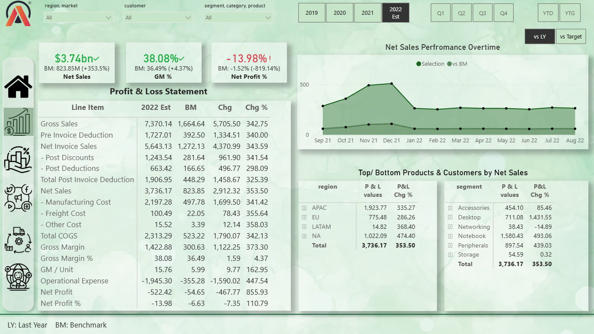
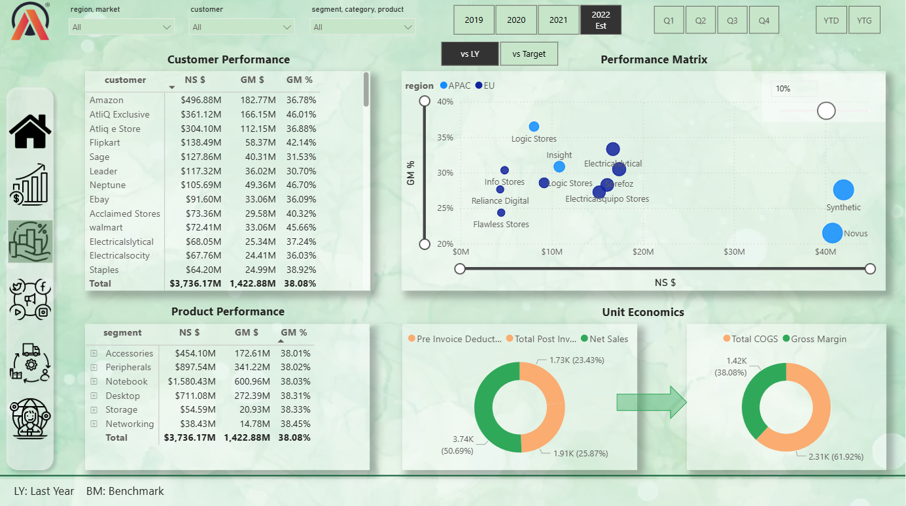
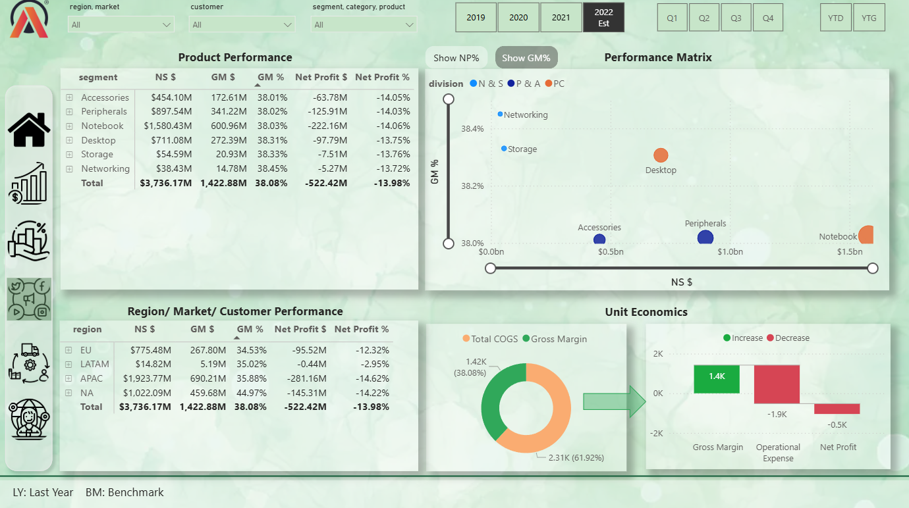
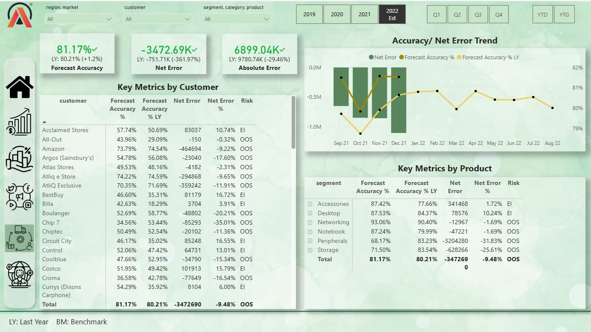
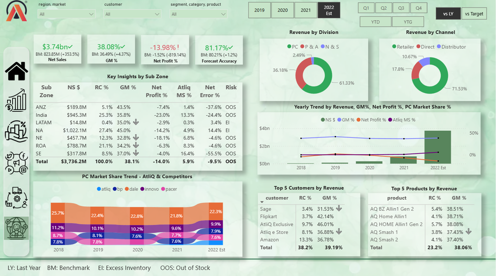
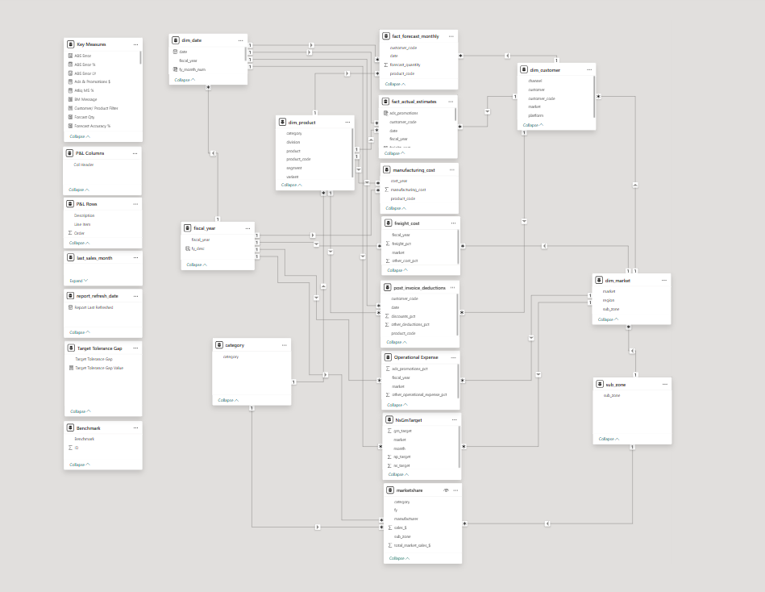

# Business Insights 360: End-to-End Power BI Solution
---

## Business Problem

Organizations often struggle with **fragmented data across departments** (Finance, Sales, Supply Chain), leading to:

* Lack of a unified view of business performance
* Inefficient decision-making due to siloed insights
* Difficulty in tracking profitability and operational efficiency

This project addresses these challenges by building a **centralized Business Intelligence solution** that provides a **360° view of enterprise performance**. [LINK](https://app.powerbi.com/view?r=eyJrIjoiZTkzNjEwZWMtODFiZS00NTc1LTg1YTktOGMzN2Y5OTVkZDJmIiwidCI6ImM2ZTU0OWIzLTVmNDUtNDAzMi1hYWU5LWQ0MjQ0ZGM1YjJjNCJ9)

---

## Key Metrics Used

* Gross price
* Pre-invoice deductions
* Post-Invoice deductions
* Net Invoice sale
* Gross Margin
* Net sales
* Net profit
* COGS - cost of goods sold
* YTD - Year to Date
* YTG - Year to Go
* Market Share %
* Net Error & Absolute Error
* Forecast Accuracy

---

## Key Insights

* Despite generating **$3.7B+ in revenue**, the business shows **negative profit margins (~14%)**, indicating high operational costs
* Certain regions and product segments consistently underperform in profitability
* **Forecast Accuracy (~81%)** reveals inefficiencies in demand planning
* Supply chain risks identified:

  * **Excess Inventory (EI)** → increased holding costs
  * **Out of Stock (OOS)** → missed revenue opportunities
* Revenue is concentrated among a few top customers, indicating **dependency risk**

---

## Dashboard Features

* Multi-domain dashboards: Finance, Sales, Marketing, Supply Chain, Executive View
* KPI tracking with dynamic filters (region, product, customer)
* Time-series trend analysis (YoY, YTD)
* Supply chain performance monitoring (Forecast Accuracy, Risk Analysis)
* Profitability breakdown using waterfall and matrix visuals
* Executive-level summary for quick decision-making

---

## Data Model

Designed using **Star Schema** for performance optimization

**Tables:**

* Fact Tables → Sales, Forecast, Manufacturing Cost, Freight Cost
* Dimension Tables → Customer, Product, Market, Date

---

## Tools & Skills

* SQL
* Power BI
* DAX (Data Analysis Expressions)
* Data Modeling (Star Schema)
* Power Query (ETL)
* Excel
* Business Intelligence & Analytics

---

## Recommendations

* Optimize pricing strategies to improve **Net Profit %**
* Improve demand forecasting to increase **Forecast Accuracy**
* Reduce **Excess Inventory and Stockouts** through better planning
* Focus on underperforming regions to improve profitability
* Diversify customer base to reduce dependency risk

---

## Live Dashboard

[Click here to view the interactive dashboard](https://app.powerbi.com/view?r=eyJrIjoiZTkzNjEwZWMtODFiZS00NTc1LTg1YTktOGMzN2Y5OTVkZDJmIiwidCI6ImM2ZTU0OWIzLTVmNDUtNDAzMi1hYWU5LWQ0MjQ0ZGM1YjJjNCJ9)

---

## Preview

### 📊 Dashboard

Finance View

  

Sales View

  

Marketing View

  

Supply Chain View

  

Executive View

  

### Data Model

  

---

## Data Modeling Approach

* Designed a **star schema model** for efficient querying and scalability
* Established relationships between fact and dimension tables
* Created calculated measures using **DAX for dynamic KPI tracking**
* Implemented time intelligence functions (YoY, YTD analysis)

---

##  What I Learned

* How to design **end-to-end BI solutions across multiple business domains**
* Importance of **data modeling for performance optimization**
* Using DAX to create **context-aware and dynamic KPIs**
* Translating raw data into **actionable business insights**
* Understanding real-world challenges in **profitability and supply chain analytics**

---

## Author

**Aditya Dhiman**
